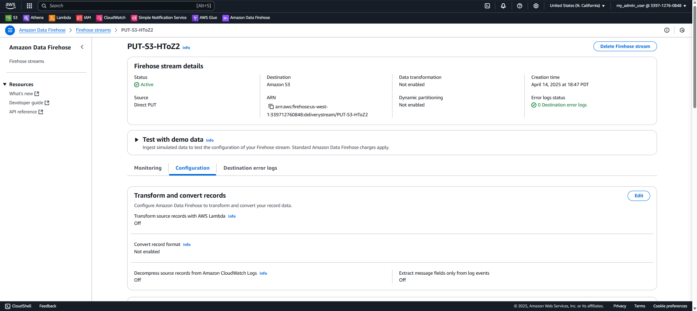
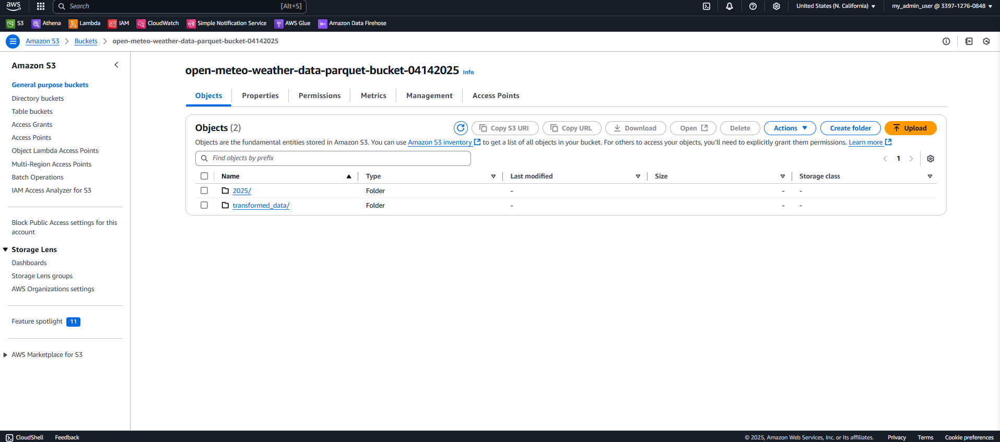
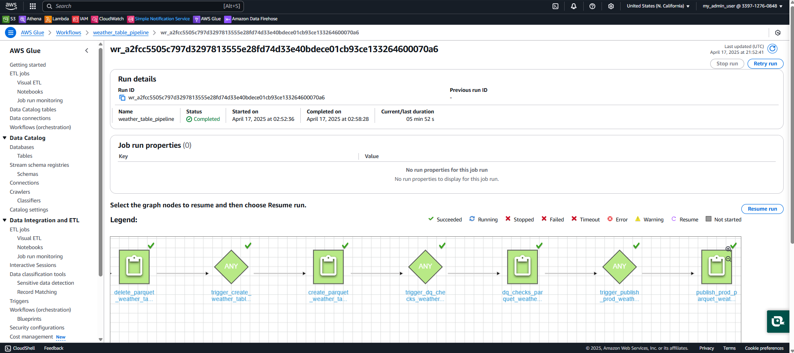

# Weather Data Pipeline Project

This project implements an end-to-end data pipeline to collect, process, and visualize historical weather data from the Open Meteo Weather API.

## Architecture Overview

The pipeline consists of the following components:

1. **Data Collection**: Lambda function fetches data from Open Meteo API and sends it to Kinesis Firehose
2. **Data Storage**: Firehose delivers data to Amazon S3 in JSON format
3. **Data Cataloging**: AWS Glue Crawler catalogs the data for querying
4. **Data Transformation**: Glue jobs transform the data into Parquet format with calculated fields
5. **Data Quality Checks**: Validation of transformed data to ensure quality
6. **Production Data**: Final transformation creates a production-ready dataset
7. **Data Visualization**: Grafana dashboard visualizes temperature trends


## Components

### 1. Lambda Function

The Lambda function collects historical weather data from Open Meteo API and forwards it to Kinesis Firehose.

```python
# Sample code showing Lambda function structure
import json
import boto3
import urllib3
import datetime

def lambda_handler(event, context):
    http = urllib3.PoolManager()
    r = http.request("GET", "https://api.open-meteo.com/v1/forecast?latitude=40.7143&longitude=-74.006&daily=temperature_2m_max&temperature_unit=fahrenheit&timezone=America%2FNew_York&start_date=2025-01-01&end_date=2025-04-16")
    
    # Process data and send to Firehose
    # ...
```


### 2. Kinesis Firehose

Firehose delivers the data to S3 in JSON format. The delivery stream is configured to buffer and batch records for efficiency.



### 3. S3 Storage

The raw data is stored in S3 buckets with the following structure:

- **Source Data**: `open-meteo-weather-data-parquet-bucket-04142025`
- **Production Data**: `parquet-weather-table-prod-04142025`
- **Query Results**: `query-results-location-de-proj-04152025`



### 4. AWS Glue Crawler

The Glue Crawler catalogs the data in the AWS Glue Data Catalog for querying.

Configuration:
- Database: `weather-database-04142025`
- Table prefix: `weather_`
- Source location: `s3://open-meteo-weather-data-parquet-bucket-04142025/`


### 5. AWS Glue Jobs

The workflow orchestrates several Glue jobs for data transformation:

#### a. Delete Job
Cleans up previous data and tables.

```python
# delete_parquet_weather_table_s3_athena.py
import sys
import boto3

# Drop existing tables
client = boto3.client('athena')
queryString = "DROP TABLE IF EXISTS table_name"
# ...
```

#### b. Create Job
Transforms the data and adds calculated fields.

```python
# create_parquet_weather_table_glue_job.py
import sys
import boto3

# Create new table with transformations
client = boto3.client('athena')
create_query = """
CREATE TABLE database_name.table_name WITH
(external_location='s3://bucket/path/',
format='PARQUET',
write_compression='SNAPPY',
partitioned_by = ARRAY['yr_mo_partition'])
AS
SELECT DISTINCT
    latitude,
    longitude,
    temp AS temp_F,
    (temp - 32) * (5.0/9.0) AS temp_C,
    row_ts,
    time,
    SUBSTRING(time,1,7) AS yr_mo_partition
FROM source_table
"""
# ...
```

#### c. DQ Checks Job
Validates data quality.

```python
# dq_checks_parquet_weather_table.py
import sys
import awswrangler as wr

NULL_DQ_CHECK = """
SELECT 
    SUM(CASE WHEN temp_C IS NULL THEN 1 ELSE 0 END) AS res_col
FROM database_name.table_name
"""
# ...
```

#### d. Publish Job
Creates the production-ready dataset.

```python
# publish_prod_parquet_weather_table.py
import sys
import boto3

# Create production table
client = boto3.client('athena')
queryString = """
CREATE TABLE prod_table WITH
(external_location='s3://prod-bucket/path/',
 format='PARQUET',
 write_compression='SNAPPY',
 partitioned_by = ARRAY['yr_mo_partition'])
AS
SELECT * FROM transformed_table
"""
# ...
```

### 6. AWS Glue Workflow

The entire pipeline is orchestrated using an AWS Glue Workflow, which runs the jobs in sequence.




### 7. Athena Tables

The processed data can be queried using Amazon Athena:

```sql
SELECT * FROM "weather-database-04142025"."open_meteo_weather_data_parquet_tbl" LIMIT 10;
```


### 8. Grafana Dashboard

The final data is visualized in a Grafana dashboard showing temperature trends over time.


## Issues and Resolutions

### Issue 1: Lambda IAM Permissions

**Problem**: Lambda function failed with `AccessDeniedException` when calling the `PutRecordBatch` operation for Firehose.

**Resolution**: Added the required `firehose:PutRecordBatch` permission to the Lambda execution role.

### Issue 2: Duplicate Records

**Problem**: When rerunning the pipeline, data records were duplicated (212 records became 424).

**Resolution**: 
- Added `DISTINCT` to the SELECT statement in the create job
- Implemented proper cleanup of previous data before creating new tables
- Used a two-step process: first drop the table, then create a new one

### Issue 3: Glue Crawler Cancellation

**Problem**: Glue Crawler was showing "CANCELLING" status.

**Resolution**: Ensured data was present in the S3 bucket before running the crawler.

### Issue 4: SQL Syntax Errors

**Problem**: Error with database names containing hyphens.

**Resolution**: Modified SQL queries to handle database names with hyphens correctly.

### Issue 5: Data Quality Check Database Reference

**Problem**: DQ checks job was referencing a non-existent database.

**Resolution**: Updated the script to use the correct database name for consistency across all components.

## Setup and Configuration

1. Configure AWS CLI with appropriate credentials
2. Create S3 buckets for source data, transformed data, and query results
3. Set up Lambda function with required permissions
4. Configure Kinesis Firehose delivery stream
5. Create Glue Crawler to catalog the data
6. Deploy Glue jobs for data transformation
7. Set up Glue Workflow to orchestrate the pipeline
8. Configure Grafana for data visualization

## Dependencies

- AWS Lambda
- Amazon Kinesis Firehose
- Amazon S3
- AWS Glue
- Amazon Athena
- Grafana
- Python libraries:
  - boto3
  - urllib3
  - awswrangler

## Further Improvements

- Add alerting for data quality issues
- Implement incremental data loading
- Add weather forecast data
- Create additional visualizations for deeper insights
- Automate deployment using Infrastructure as Code (CloudFormation/CDK)