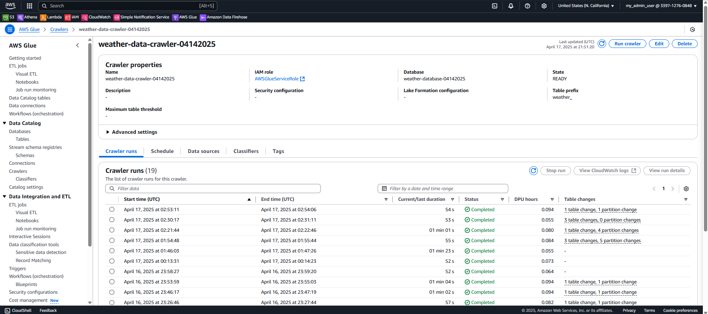
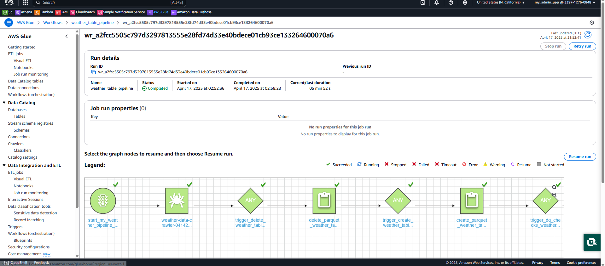
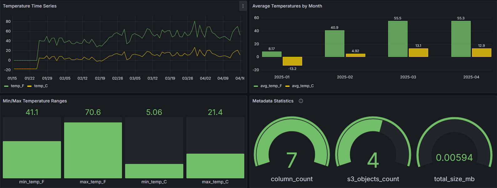

# Weather Data Pipeline Project

This project implements an end-to-end data pipeline to collect, process, and visualize historical weather data from the Open Meteo Weather API.

## Table of Contents

- [Architecture Overview](#architecture-overview)
- [Components](#components)
  - [1. Lambda Function](#1-lambda-function)
  - [2. Kinesis Firehose](#2-kinesis-firehose)
  - [3. S3 Storage](#3-s3-storage)
  - [4. AWS Glue Crawler](#4-aws-glue-crawler)
  - [5. AWS Glue Jobs](#5-aws-glue-jobs)
    - [a. Delete Job](#a-delete-job)
    - [b. Create Job](#b-create-job)
    - [c. DQ Checks Job](#c-dq-checks-job)
    - [d. Publish Job](#d-publish-job)
  - [6. AWS Glue Workflow](#6-aws-glue-workflow)
  - [7. Weather Metadata Extractor](#7-weather-metadata-extractor)
  - [8. Metadata in Grafana](#metadata-in-grafana)
  - [9. Athena Tables](#8-athena-tables)
  - [10. Grafana Dashboard](#9-grafana-dashboard)
- [Key Findings from Weather Data Analysis](#key-findings-from-weather-data-analysis)
- [Issues and Resolutions](#issues-and-resolutions)
- [Setup and Configuration](#setup-and-configuration)
- [Dependencies](#dependencies)
- [Further Improvements](#further-improvements)


## Architecture Overview

The pipeline consists of the following components:

1. **Data Collection**: Lambda function fetches data from Open Meteo API and sends it to Kinesis Firehose
2. **Data Storage**: Firehose delivers data to Amazon S3 in JSON format
3. **Data Cataloging**: AWS Glue Crawler catalogs the data for querying
4. **Data Transformation**: Glue jobs transform the data into Parquet format with calculated fields
5. **Data Quality Checks**: Validation of transformed data to ensure quality
6. **Production Data**: Final transformation creates a production-ready dataset
7. **Metadata Extraction**: Lambda function extracts metadata from the weather data tables
8. **Data Visualization**: Grafana dashboard visualizes temperature trends

### Architecture Diagram

For interactive diagrams, you can access:
- [Weather Data Pipeline Interactive Diagram](diagram.html)
- [Weather Metadata Extractor Interactive Diagram](diagram_metadata_extractor.html)

### Flowchart


## Components

### 1. Lambda Function

The Lambda function collects historical weather data from Open Meteo API and forwards it to Kinesis Firehose.

```python
# Sample code showing Lambda function structure
import json
import boto3
import urllib3
import datetime

def lambda_handler(event, context):
    http = urllib3.PoolManager()
    r = http.request("GET", "https://api.open-meteo.com/v1/forecast?latitude=40.7143&longitude=-74.006&daily=temperature_2m_max&temperature_unit=fahrenheit&timezone=America%2FNew_York&start_date=2025-01-01&end_date=2025-04-16")
    
    # Process data and send to Firehose
    # ...
```


### 2. Kinesis Firehose

Firehose delivers the data to S3 in JSON format. The delivery stream is configured to buffer and batch records for efficiency.


### 3. S3 Storage

The raw data is stored in S3 buckets with the following structure:

- **Source Data**: `open-meteo-weather-data-parquet-bucket-04142025`
- **Production Data**: `parquet-weather-table-prod-04142025`
- **Query Results**: `query-results-location-de-proj-04152025`


### 4. AWS Glue Crawler

The Glue Crawler catalogs the data in the AWS Glue Data Catalog for querying.

Configuration:
- Database: `weather-database-04142025`
- Table prefix: `weather_`
- Source location: `s3://open-meteo-weather-data-parquet-bucket-04142025/`



### 5. AWS Glue Jobs

The workflow orchestrates several Glue jobs for data transformation:

#### a. Delete Job
Cleans up previous data and tables.

```python
# delete_parquet_weather_table_s3_athena.py
import sys
import boto3

# Drop existing tables
client = boto3.client('athena')
queryString = "DROP TABLE IF EXISTS table_name"
# ...
```

#### b. Create Job
Transforms the data and adds calculated fields.

```python
# create_parquet_weather_table_glue_job.py
import sys
import boto3

# Create new table with transformations
client = boto3.client('athena')
create_query = """
CREATE TABLE database_name.table_name WITH
(external_location='s3://bucket/path/',
format='PARQUET',
write_compression='SNAPPY',
partitioned_by = ARRAY['yr_mo_partition'])
AS
SELECT DISTINCT
    latitude,
    longitude,
    temp AS temp_F,
    (temp - 32) * (5.0/9.0) AS temp_C,
    row_ts,
    time,
    SUBSTRING(time,1,7) AS yr_mo_partition
FROM source_table
"""
# ...
```

#### c. DQ Checks Job
Validates data quality.

```python
# dq_checks_parquet_weather_table.py
import sys
import awswrangler as wr

NULL_DQ_CHECK = """
SELECT 
    SUM(CASE WHEN temp_C IS NULL THEN 1 ELSE 0 END) AS res_col
FROM database_name.table_name
"""
# ...
```

#### d. Publish Job
Creates the production-ready dataset.

```python
# publish_prod_parquet_weather_table.py
import sys
import boto3

# Create production table
client = boto3.client('athena')
queryString = """
CREATE TABLE prod_table WITH
(external_location='s3://prod-bucket/path/',
 format='PARQUET',
 write_compression='SNAPPY',
 partitioned_by = ARRAY['yr_mo_partition'])
AS
SELECT * FROM transformed_table
"""
# ...
```

### 6. AWS Glue Workflow

The entire pipeline is orchestrated using an AWS Glue Workflow, which runs the jobs in sequence.




### 7. Weather Metadata Extractor

The Weather Metadata Extractor is a Lambda function that automatically extracts and catalogs metadata from the weather data tables, making it available for querying and monitoring.


#### Key Features:

- **Automated Metadata Extraction**: Triggered by EventBridge (CloudWatch Events) when new data is available
- **Multiple Metadata Formats**: Stores metadata in various formats optimized for different use cases
- **Table Statistics**: Collects information like object count, size, and last modification time
- **Schema Information**: Records column definitions, data types, and partition keys
- **Athena-Compatible**: Creates metadata tables that can be queried directly with SQL

```python
# weather_data_metadata_extractor.py (simplified)
import json
import boto3
import logging
from datetime import datetime
import re
import os

def lambda_handler(event, context):
    """
    Lambda function to extract metadata from weather data tables
    and save it to S3 in JSON format optimized for Athena querying
    """
    try:
        # Configurations
        source_database_name = "weather-database-04142025"
        results_bucket = "query-results-location-de-proj-04152025"
        table_name = "open_meteo_weather_data_parquet_tbl_prod_2025_04_17_02_58_16_622979"
        
        # Get table information from Glue
        glue_client = boto3.client('glue')
        table_response = glue_client.get_table(
            DatabaseName=source_database_name,
            Name=table_name
        )
        
        # Extract table metadata and S3 information
        s3_client = boto3.client('s3')
        s3_objects = get_s3_metadata(bucket_name, prefix)
        
        # Create metadata record
        flattened_metadata = {
            "table_name": table_name,
            "source_database": source_database_name,
            "extraction_time": datetime.now().strftime("%Y-%m-%d %H:%M:%S"),
            "column_count": len(table_info["columns"]),
            "s3_location": s3_location,
            "s3_objects_count": len(s3_objects),
            "s3_total_size_bytes": sum(obj.get("size", 0) for obj in s3_objects),
            "s3_latest_modification": max(obj.get("last_modified") for obj in s3_objects if obj.get("last_modified"))
        }
        
        # Save metadata to S3 in different formats
        # 1. Flattened format for Athena querying
        # 2. Detailed format with complete information
        # 3. Manifest file pointing to the latest metadata
        
        return {
            "statusCode": 200,
            "body": json.dumps({
                "message": "Successfully saved weather data metadata",
                "metadata_summary": {
                    "objects_count": len(s3_objects),
                    "total_size_bytes": sum(obj.get("size", 0) for obj in s3_objects)
                }
            })
        }
    except Exception as e:
        return {
            "statusCode": 500,
            "body": json.dumps({
                "message": f"Error: {str(e)}"
            })
        }

def get_s3_metadata(bucket_name, prefix):
    """
    Retrieve metadata for objects in the S3 bucket
    """
    s3_objects = []
    # List objects in S3 and collect metadata
    # ...
    return s3_objects
```

## Metadata in Grafana

Sample Athena query for metadata visualization:
```sql
SELECT 
  extraction_time,
  table_name,
  column_count,
  s3_objects_count,
  CAST(s3_total_size_bytes AS DOUBLE) / 1024 / 1024 AS total_size_mb,
  source_database
FROM 
  "weather_metadata_results"."weather_metadata_flat"
WHERE 
  table_name LIKE '%open_meteo_weather_data_parquet_tbl_prod%'
  AND extraction_time BETWEEN ${__timeFrom:date} AND ${__timeTo:date}
ORDER BY 
  extraction_time DESC
LIMIT 100;
```

This integration provides a complete view of both the weather data itself and the metadata about your data pipeline, enabling better monitoring and troubleshooting.

#### Benefits for Application-to-Application Reconciliation:

1. **Data Lineage Tracking**: Captures the full flow of data through the pipeline, making it easier to trace issues back to their source

2. **Data Quality Monitoring**: Provides metrics to compare data quality across different stages of processing

3. **System Verification**: Allows automated verification that all components of the pipeline are functioning correctly

4. **Cross-System Comparison**: Enables comparison of metadata between different systems for reconciliation purposes
   - Compare record counts between source API and final tables
   - Verify that all expected data transformations occurred
   - Ensure no data was lost during the pipeline processing

5. **Auditing and Compliance**: Creates a record of data processing for audit purposes, tracking when data was processed and how it changed

6. **Operational Monitoring**: Detects issues like missing partitions, unexpected schema changes, or data volume anomalies

7. **Self-Documenting Pipeline**: Provides up-to-date documentation of the data structure and processing steps

The metadata is stored in the following formats:

- **Flattened Metadata**: JSON files optimized for Athena querying
- **Detailed Metadata**: Complete information with full S3 object details
- **Manifest Files**: Quick lookup files pointing to the latest metadata

This metadata can be queried using Athena:

```sql
SELECT * FROM "weather_metadata_results"."weather_metadata_flat" LIMIT 10;
```


### 8. Athena Tables

The processed data can be queried using Amazon Athena:

```sql
SELECT * FROM "weather-database-04142025"."open_meteo_weather_data_parquet_tbl" LIMIT 10;
```

### 9. Grafana Dashboard

The final data is visualized in a Grafana dashboard showing temperature trends over time.



## Key Findings from Weather Data Analysis

Based on the temperature data displayed in the Grafana dashboard for January through April 2025:

### Temperature Trends Over Time
- **Overall Warming Trend**: The time series graph shows a general increase in temperatures from January through April, with average temperatures rising from around 30-40°F in January to 40-60°F by mid-April.
- **Increasing Volatility**: Temperature fluctuations became more pronounced in March and April, with wider swings between daily readings.
- **Peak Temperature**: The highest recorded temperature was 80°F in late March, showing an unseasonable warm spell.

### Monthly Temperature Analysis
- **January 2025**: Coldest month with an average temperature of 8.17°F (Fahrenheit) and -13.2°C (Celsius).
- **February 2025**: Significant warming with average temperatures rising to 40.9°F (4.92°C).
- **March 2025**: Continued warming trend with average temperatures reaching 55.5°F (13.1°C).
- **April 2025**: Slight decrease in warming rate but still warm at 55.3°F (12.9°C).

### Temperature Ranges
- **Minimum Fahrenheit**: 41.1°F
- **Maximum Fahrenheit**: 70.6°F
- **Minimum Celsius**: 5.06°C
- **Maximum Celsius**: 21.4°C
- **Temperature Range**: The data shows a wide range of approximately 29.5°F between minimum and maximum temperatures.

### Weather Patterns
- The dramatic increase from January to February (over 32°F average temperature increase) suggests either an unusually cold January or an extraordinarily warm February.
- March and April maintained similar average temperatures, indicating a potential early plateau in the spring warming cycle.
- The negative average Celsius temperature in January confirms freezing conditions persisted throughout much of the month.

These insights demonstrate the value of the data pipeline in capturing, processing, and visualizing weather trends, enabling both historical analysis and potential predictive capabilities for future seasonal patterns.

## Issues and Resolutions

### Issue 1: Lambda IAM Permissions

**Problem**: Lambda function failed with `AccessDeniedException` when calling the `PutRecordBatch` operation for Firehose.

**Resolution**: Added the required `firehose:PutRecordBatch` permission to the Lambda execution role.

### Issue 2: Duplicate Records

**Problem**: When rerunning the pipeline, data records were duplicated (212 records became 424).

**Resolution**: 
- Added `DISTINCT` to the SELECT statement in the create job
- Implemented proper cleanup of previous data before creating new tables
- Used a two-step process: first drop the table, then create a new one

### Issue 3: Glue Crawler Cancellation

**Problem**: Glue Crawler was showing "CANCELLING" status.

**Resolution**: Ensured data was present in the S3 bucket before running the crawler.

### Issue 4: SQL Syntax Errors

**Problem**: Error with database names containing hyphens.

**Resolution**: Modified SQL queries to handle database names with hyphens correctly.

### Issue 5: Data Quality Check Database Reference

**Problem**: DQ checks job was referencing a non-existent database.

**Resolution**: Updated the script to use the correct database name for consistency across all components.

### Issue 6: Metadata Lambda Permissions

**Problem**: Metadata Extractor Lambda couldn't access the Glue Catalog.

**Resolution**: Added `glue:GetTable` and `glue:GetDatabase` permissions to the Lambda execution role.

## Setup and Configuration

1. Configure AWS CLI with appropriate credentials
2. Create S3 buckets for source data, transformed data, and query results
3. Set up Lambda function with required permissions
4. Configure Kinesis Firehose delivery stream
5. Create Glue Crawler to catalog the data
6. Deploy Glue jobs for data transformation
7. Set up Glue Workflow to orchestrate the pipeline
8. Deploy Metadata Extractor Lambda with EventBridge trigger
9. Configure Grafana for data visualization

## Dependencies

- AWS Lambda
- Amazon Kinesis Firehose
- Amazon S3
- AWS Glue
- Amazon Athena
- AWS EventBridge
- Grafana
- Python libraries:
  - boto3
  - urllib3
  - awswrangler

## Further Improvements

- Add alerting for data quality issues
- Implement incremental data loading
- Add weather forecast data
- Create additional visualizations for deeper insights
- Automate deployment using Infrastructure as Code (CloudFormation/CDK)
- Enhance metadata with historical trends to detect data drift
- Implement automated data quality reporting based on metadata
