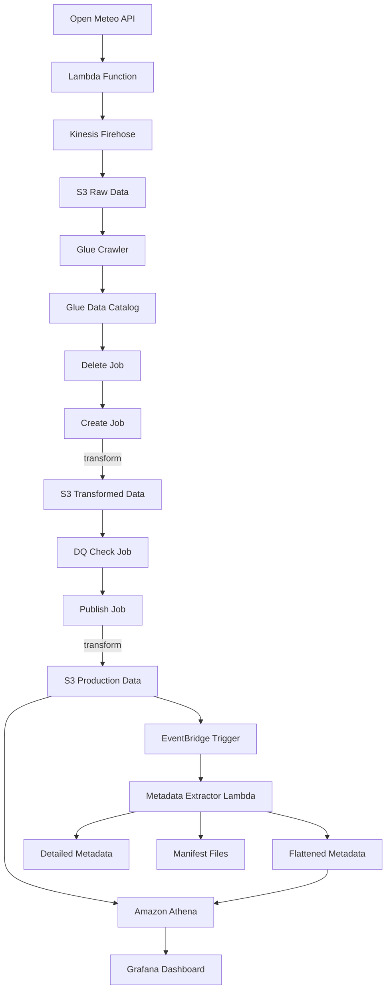
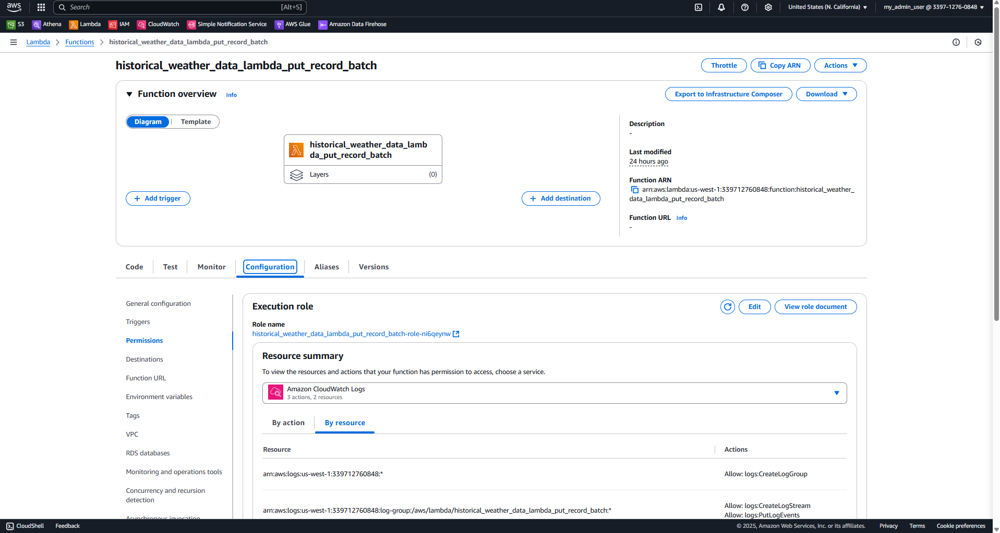
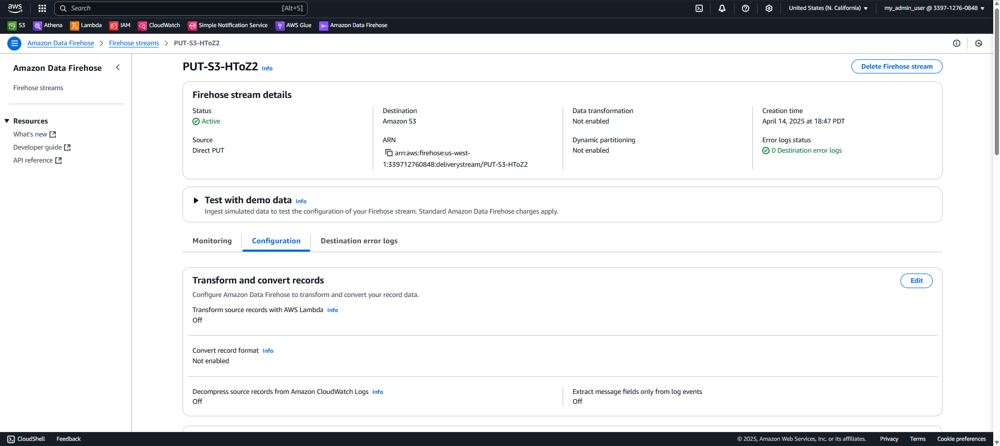
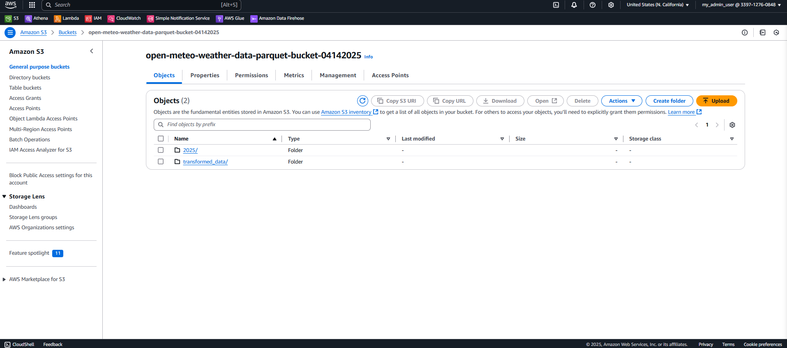
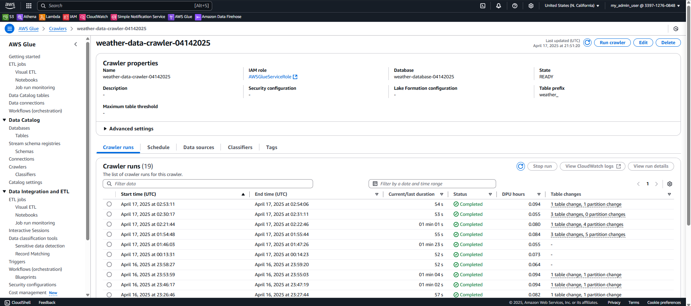
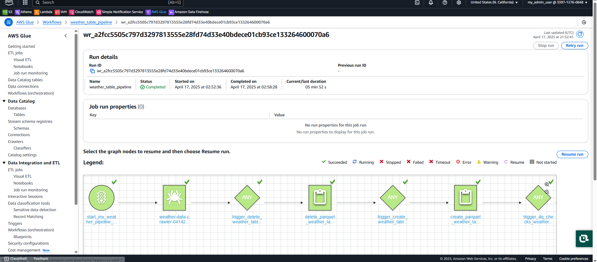
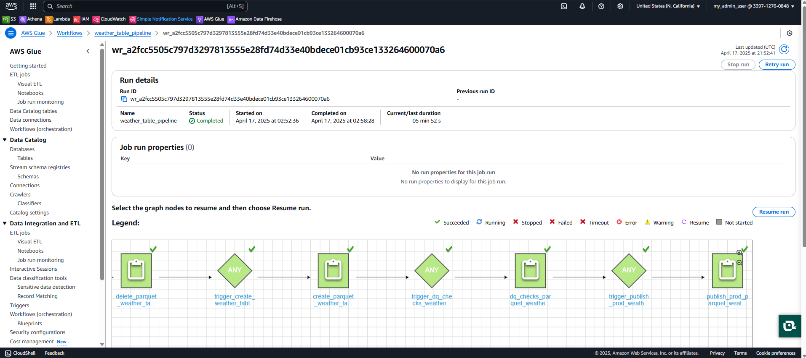
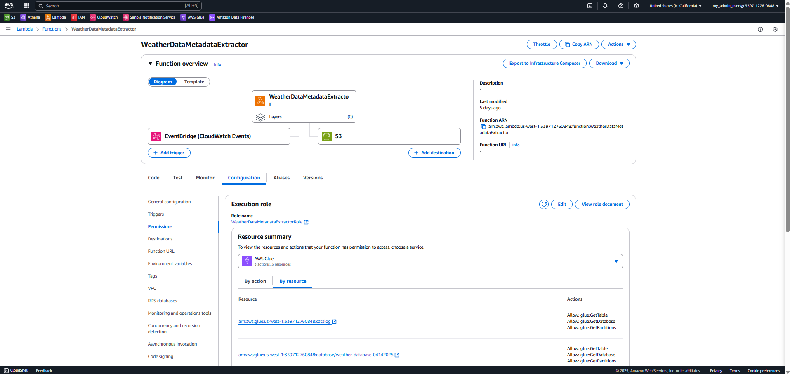
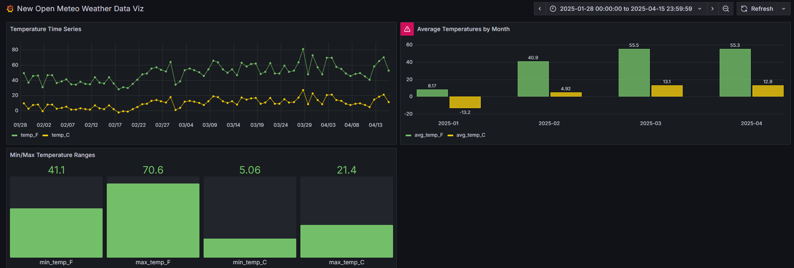

# Weather Data Pipeline Project

An end-to-end data pipeline to collect, process, and visualize historical weather data from the Open Meteo Weather API.

---

## Architecture Overview

The pipeline consists of the following components:

1. **Data Collection**: Lambda function fetches data from Open Meteo API and sends it to Kinesis Firehose
2. **Data Storage**: Firehose delivers data to Amazon S3 in JSON format
3. **Data Cataloging**: AWS Glue Crawler catalogs the data for querying
4. **Data Transformation**: Glue jobs transform the data into Parquet format with calculated fields
5. **Data Quality Checks**: Validation of transformed data to ensure quality
6. **Production Data**: Final transformation creates a production-ready dataset
7. **Metadata Extraction**: Lambda function extracts metadata from the weather data tables
8. **Data Visualization**: Grafana dashboard visualizes temperature trends

---

## Architecture Diagram

For interactive diagrams, you can access:
- [Weather Data Pipeline Interactive Diagram](diagram.html)
- [Weather Metadata Extractor Interactive Diagram](diagram_metadata_extractor.html)

---

## Pipeline Flowchart



---

## Components

---

### 1. Lambda Function

The Lambda function collects historical weather data from Open Meteo API and forwards it to Kinesis Firehose.

```python
# Sample code showing Lambda function structure
import json
import boto3
import urllib3
import datetime

def lambda_handler(event, context):
    http = urllib3.PoolManager()
    r = http.request("GET", "https://api.open-meteo.com/v1/forecast?latitude=40.7143&longitude=-74.006&daily=temperature_2m_max&temperature_unit=fahrenheit&timezone=America%2FNew_York&start_date=2025-01-01&end_date=2025-04-16")
    
    # Process data and send to Firehose
    # ...
```

----



---

### 2. Kinesis Firehose

Firehose delivers the data to S3 in JSON format. The delivery stream is configured to buffer and batch records for efficiency.



---

### 3. S3 Storage

The raw data is stored in S3 buckets with the following structure:

- **Source Data**: `open-meteo-weather-data-parquet-bucket-04142025`
- **Production Data**: `parquet-weather-table-prod-04142025`
- **Query Results**: `query-results-location-de-proj-04152025`

----



---

### 4. AWS Glue Crawler

The Glue Crawler catalogs the data in the AWS Glue Data Catalog for querying.

Configuration:
- Database: `weather-database-04142025`
- Table prefix: `weather_`
- Source location: `s3://open-meteo-weather-data-parquet-bucket-04142025/`

----



---

### 5. AWS Glue Jobs

The workflow orchestrates several Glue jobs for data transformation:

---

#### a. Delete Job
Cleans up previous data and tables.

```python
# delete_parquet_weather_table_s3_athena.py
import sys
import boto3

# Drop existing tables
client = boto3.client('athena')
queryString = "DROP TABLE IF EXISTS table_name"
# ...
```

---

#### b. Create Job
Transforms the data and adds calculated fields.

```python
# create_parquet_weather_table_glue_job.py
import sys
import boto3

# Create new table with transformations
client = boto3.client('athena')
create_query = """
CREATE TABLE database_name.table_name WITH
(external_location='s3://bucket/path/',
format='PARQUET',
write_compression='SNAPPY',
partitioned_by = ARRAY['yr_mo_partition'])
AS
SELECT DISTINCT
    latitude,
    longitude,
    temp AS temp_F,
    (temp - 32) * (5.0/9.0) AS temp_C,
    row_ts,
    time,
    SUBSTRING(time,1,7) AS yr_mo_partition
FROM source_table
"""
# ...
```

---

#### c. DQ Checks Job
Validates data quality.

```python
# dq_checks_parquet_weather_table.py
import sys
import awswrangler as wr

NULL_DQ_CHECK = """
SELECT 
    SUM(CASE WHEN temp_C IS NULL THEN 1 ELSE 0 END) AS res_col
FROM database_name.table_name
"""
# ...
```

---

#### d. Publish Job
Creates the production-ready dataset.

```python
# publish_prod_parquet_weather_table.py
import sys
import boto3

# Create production table
client = boto3.client('athena')
queryString = """
CREATE TABLE prod_table WITH
(external_location='s3://prod-bucket/path/',
 format='PARQUET',
 write_compression='SNAPPY',
 partitioned_by = ARRAY['yr_mo_partition'])
AS
SELECT * FROM transformed_table
"""
# ...
```

---

### 6. AWS Glue Workflow

The entire pipeline is orchestrated using an AWS Glue Workflow, which runs the jobs in sequence.



----



---

### 7. Weather Metadata Extractor

The Weather Metadata Extractor is a Lambda function that automatically extracts and catalogs metadata from the weather data tables, making it available for querying and monitoring.



----

#### Key Features:

- **Automated Metadata Extraction**: Triggered by EventBridge (CloudWatch Events) when new data is available
- **Multiple Metadata Formats**: Stores metadata in various formats optimized for different use cases
- **Table Statistics**: Collects information like object count, size, and last modification time
- **Schema Information**: Records column definitions, data types, and partition keys
- **Athena-Compatible**: Creates metadata tables that can be queried directly with SQL

----

```python
# weather_data_metadata_extractor.py (simplified)
import json
import boto3
import logging
from datetime import datetime

def lambda_handler(event, context):
    """
    Lambda function to extract metadata from weather data tables
    and save it to S3 in JSON format optimized for Athena querying
    """
    # Get table information from Glue
    # Extract table metadata and S3 information
    # Create flattened metadata record
    # Save metadata to S3 in different formats
    # ...
```

---

#### Benefits for Application-to-Application Reconciliation:

- **Data Lineage Tracking**: Traces issues back to their source
- **Data Quality Monitoring**: Provides metrics to compare data quality across stages
- **Cross-System Comparison**: Enables comparison of metadata between different systems
- **Auditing and Compliance**: Creates a record of data processing for audit purposes
- **Operational Monitoring**: Detects issues like missing partitions or schema changes

---

### 8. Athena Tables

The processed data can be queried using Amazon Athena:

```sql
SELECT * FROM "weather-database-04142025"."open_meteo_weather_data_parquet_tbl" LIMIT 10;
```

----

#### Metadata Query Example:

```sql
SELECT
  extraction_time,
  table_name,
  column_count,
  s3_objects_count,
  CAST(s3_total_size_bytes AS DOUBLE) / 1024 / 1024 AS total_size_mb
FROM
  weather_metadata_flat
WHERE
  table_name LIKE '%prod%'
LIMIT 10
```

---

### 9. Grafana Dashboard

The final data is visualized in a Grafana dashboard showing temperature trends over time.



---

## Key Findings from Weather Data Analysis

Based on the temperature data from January through April 2025:

---

### Temperature Trends Over Time
- **Overall Warming Trend**: General increase from January through April
- **Increasing Volatility**: More pronounced fluctuations in March and April
- **Peak Temperature**: Highest recorded temperature was 80°F in late March

---

### Monthly Temperature Analysis
- **January 2025**: Coldest month with avg 8.17°F (-13.2°C)
- **February 2025**: Significant warming to avg 40.9°F (4.92°C)
- **March 2025**: Continued warming to avg 55.5°F (13.1°C)
- **April 2025**: Slight decrease in warming rate to 55.3°F (12.9°C)

---

### Temperature Ranges
- **Minimum Fahrenheit**: 41.1°F
- **Maximum Fahrenheit**: 70.6°F
- **Minimum Celsius**: 5.06°C
- **Maximum Celsius**: 21.4°C
- **Temperature Range**: Approximately 29.5°F between min/max

---

## Issues and Resolutions

---

### Issue 1: Lambda IAM Permissions

**Problem**: Lambda function failed with `AccessDeniedException` when calling the `PutRecordBatch` operation for Firehose.

**Resolution**: Added the required `firehose:PutRecordBatch` permission to the Lambda execution role.

---

### Issue 2: Duplicate Records

**Problem**: When rerunning the pipeline, data records were duplicated.

**Resolution**: 
- Added `DISTINCT` to the SELECT statement in the create job
- Implemented proper cleanup of previous data before creating new tables

---

### Issue 3: Glue Crawler Cancellation

**Problem**: Glue Crawler was showing "CANCELLING" status.

**Resolution**: Ensured data was present in the S3 bucket before running the crawler.

---

### Issue 4: SQL Syntax Errors

**Problem**: Error with database names containing hyphens.

**Resolution**: Modified SQL queries to handle database names with hyphens correctly.

---

### Issue 5: Data Quality Check Database Reference

**Problem**: DQ checks job was referencing a non-existent database.

**Resolution**: Updated the script to use the correct database name for consistency.

---

### Issue 6: Metadata Lambda Permissions

**Problem**: Metadata Extractor Lambda couldn't access the Glue Catalog.

**Resolution**: Added `glue:GetTable` and `glue:GetDatabase` permissions to the Lambda execution role.

---

## Using the Metadata in Grafana

1. Configure an Athena data source in Grafana
2. Add a new metadata statistics panel
3. Create a metadata trend graph to visualize pipeline health

---

## Further Improvements

- Add alerting for data quality issues
- Implement incremental data loading
- Add weather forecast data
- Create additional visualizations
- Automate deployment using Infrastructure as Code
- Enhance metadata with historical trends to detect data drift
- Implement automated data quality reporting based on metadata

---

## Thank you

Weather Data Pipeline Project  
Created by: Anand V. Sharan  
Contact: anand.v.sharan@gmail.com

<!-- 
Speaker notes:
This presentation covers the complete architecture of our weather data pipeline
Highlight the metadata extraction component as a new feature
The key findings section shows real insights from our collected data
-->